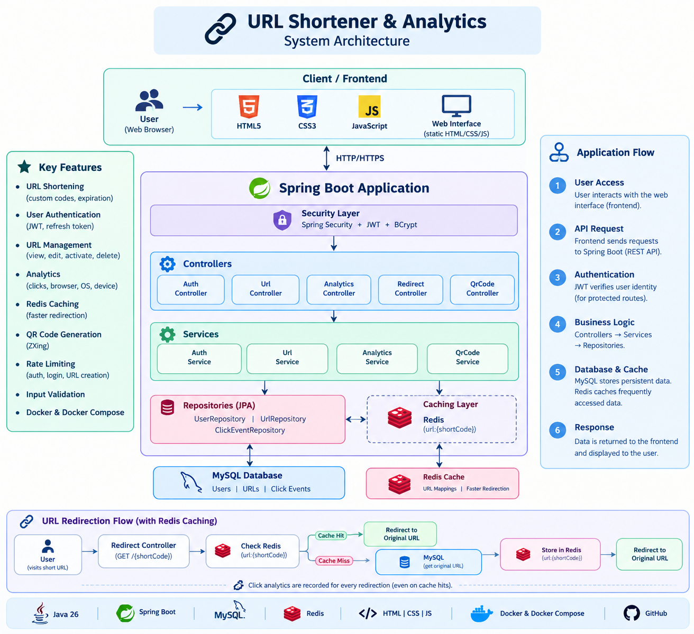
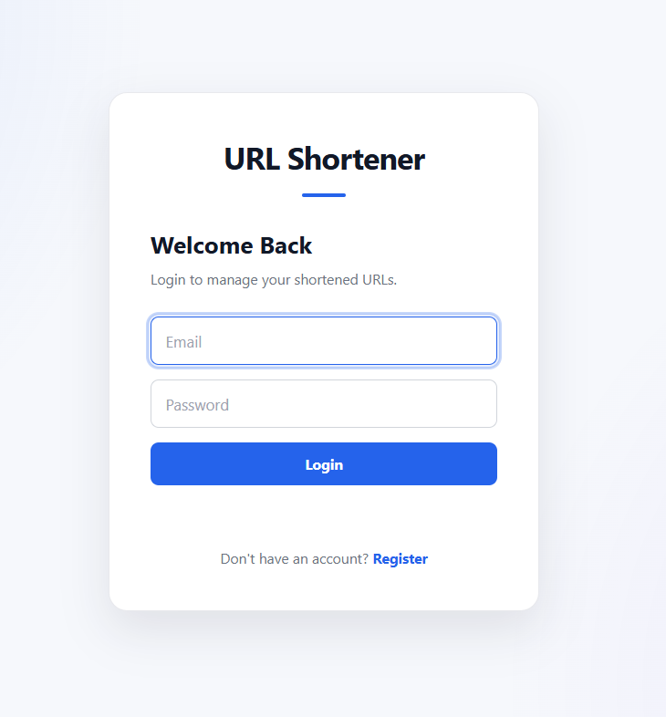
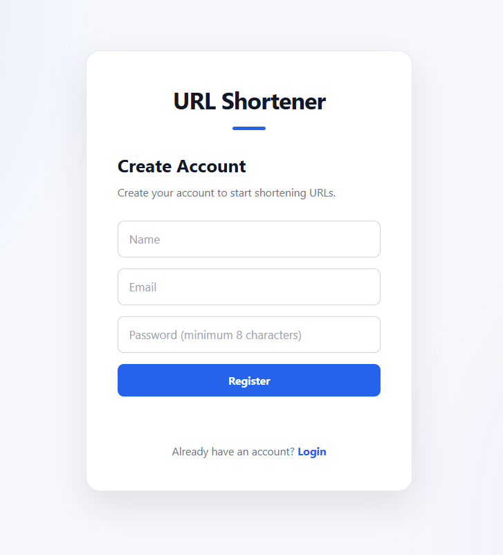
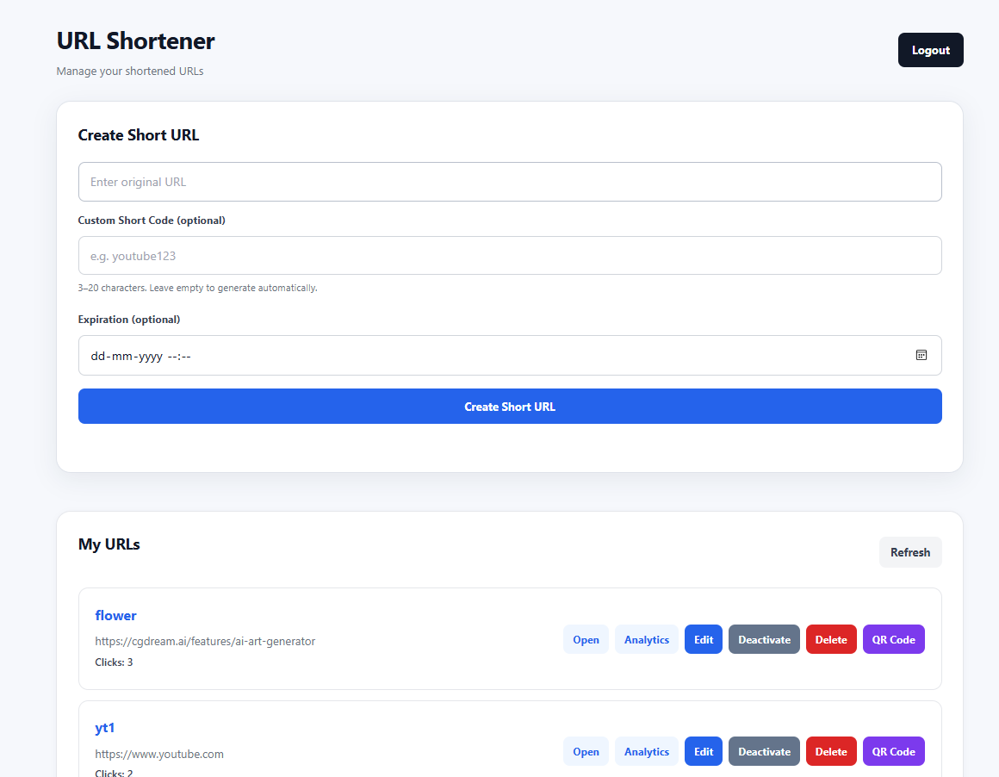
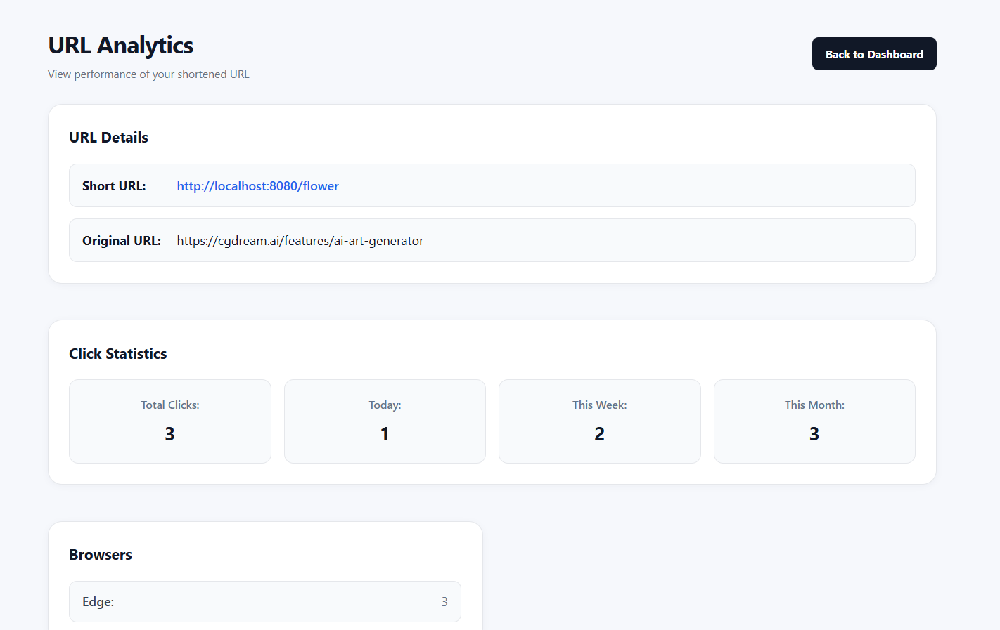
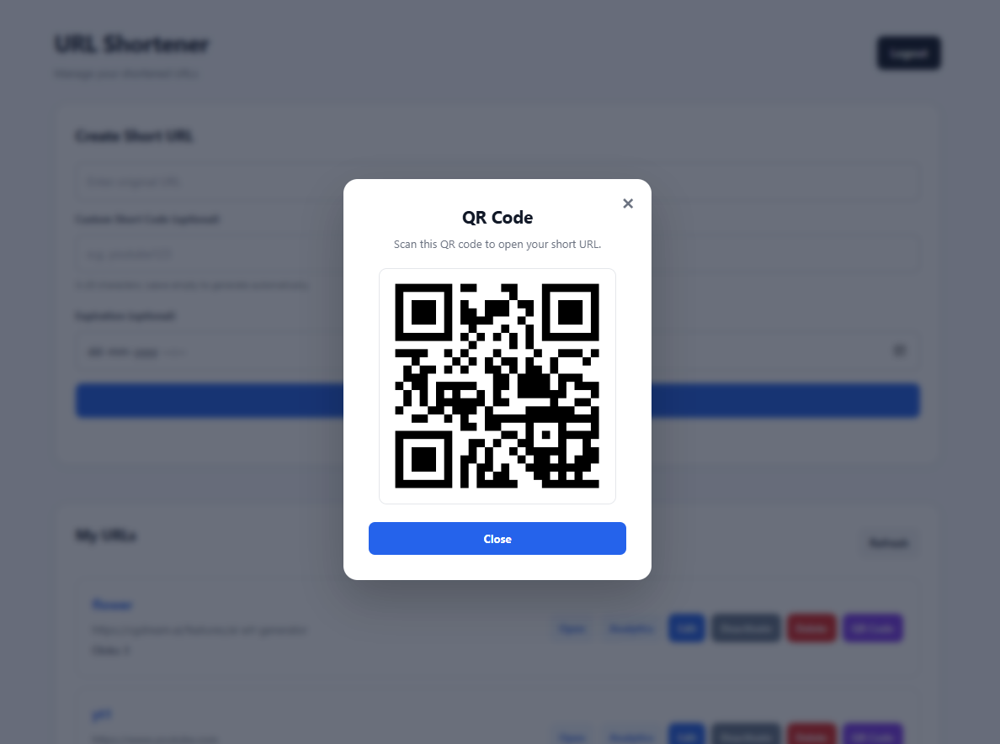

# URL Shortener & Analytics

A full-stack URL shortening platform built with Spring Boot, MySQL, Redis, JWT Authentication, and a responsive web frontend.

The application allows users to create short URLs, manage them, track click analytics, generate QR codes, and securely access their own URLs.

---

## Overview

This project is a Bitly-style URL shortening application developed to practice and demonstrate real-world backend development using Spring Boot.

Users can:

- Create shortened URLs
- Generate custom short codes
- Set URL expiration dates
- Redirect users through shortened URLs
- Track click analytics
- View browser, operating system, and device statistics
- Manage their URLs
- Activate or deactivate URLs
- Delete URLs
- Generate QR codes
- Authenticate using JWT
- Use Redis caching for faster URL redirection

The application is containerized using Docker and can be deployed using a cloud-based database and Redis service.

---

## Features

### URL Shortening

- Generate unique short URLs
- Support custom short codes
- Validate original URLs
- Optional expiration dates
- Automatic short-code generation

### Authentication

- User registration
- User login
- JWT-based authentication
- Refresh token support
- Password hashing
- Protected API endpoints
- User-specific URL management

### Analytics

Track URL performance with:

- Total clicks
- Clicks today
- Clicks this week
- Clicks this month
- Browser statistics
- Operating system statistics
- Device statistics

### Redis Caching

Redis is used to cache short-code to original-URL mappings.

When a shortened URL is requested:

    Request
       |
       v
    Redis Cache
       |
       +-- Cache Hit --> Redirect
       |
       +-- Cache Miss
              |
              v
           MySQL
              |
              v
        Store in Redis
              |
              v
           Redirect

Click analytics are still recorded when a cached URL is accessed.

### QR Code Generation

Users can generate a QR code for their shortened URL.

QR codes are generated using ZXing (Zebra Crossing).

### URL Management

Authenticated users can:

- View their URLs
- View individual URL details
- Edit URLs
- Activate URLs
- Deactivate URLs
- Delete URLs
- View analytics
- Open shortened URLs
- Generate QR codes

### Security

The application includes:

- Spring Security
- JWT authentication
- BCrypt password hashing
- Protected API endpoints
- Input validation
- Authentication rate limiting
- Login rate limiting
- URL creation rate limiting

### Docker

The application can run using Docker Compose with:

- Spring Boot application
- MySQL
- Redis

---

## Tech Stack

### Backend

- Java 26
- Spring Boot
- Spring Web
- Spring Data JPA
- Spring Security
- Hibernate
- Maven

### Database

- MySQL 8

### Caching

- Redis
- Spring Data Redis

### Authentication

- JWT
- JJWT
- BCrypt

### QR Code

- ZXing

### Frontend

- HTML5
- CSS3
- JavaScript

### Development Tools

- IntelliJ IDEA
- Postman
- Git
- GitHub
- Docker
- Docker Compose

---

## Architecture

The application follows a layered Spring Boot architecture.

The main application flow is:

    Frontend
        |
        v
    REST Controllers
        |
        v
    Services
        |
        +----------------+
        |                |
        v                v
      Redis             MySQL
      Cache            Database

The application uses Redis for frequently accessed URL mappings and MySQL for persistent application data.

---

## Project Structure

    src/
    ├── main/
    │   ├── java/
    │   │   └── com/
    │   │       └── susu/
    │   │           └── urlshortener/
    │   │
    │   │               ├── config/
    │   │               │   ├── CorsConfig.java
    │   │               │   ├── PasswordConfig.java
    │   │               │   └── SecurityConfig.java
    │   │               │
    │   │               ├── controller/
    │   │               │   ├── AnalyticsController.java
    │   │               │   ├── AuthController.java
    │   │               │   ├── QrCodeController.java
    │   │               │   ├── RedirectController.java
    │   │               │   └── UrlController.java
    │   │               │
    │   │               ├── dto/
    │   │               │   ├── CreateUrlRequest.java
    │   │               │   ├── LoginRequest.java
    │   │               │   ├── RegisterRequest.java
    │   │               │   └── UpdateUrlRequest.java
    │   │               │
    │   │               ├── entity/
    │   │               │   ├── ClickEvent.java
    │   │               │   ├── Url.java
    │   │               │   └── User.java
    │   │               │
    │   │               ├── repository/
    │   │               │   ├── ClickEventRepository.java
    │   │               │   ├── UrlRepository.java
    │   │               │   └── UserRepository.java
    │   │               │
    │   │               ├── security/
    │   │               │   ├── JwtAuthenticationFilter.java
    │   │               │   └── JwtService.java
    │   │               │
    │   │               └── service/
    │   │                   ├── AnalyticsService.java
    │   │                   ├── AuthService.java
    │   │                   ├── QrCodeService.java
    │   │                   └── UrlService.java
    │   │
    │   └── resources/
    │       └── application.properties
    │
    └── forntend/
        ├── index.html
        ├── login.html
        ├── register.html
        ├── dashboard.html
        ├── analytics.html
        │
        ├── css/
        │   └── style.css
        │
        └── js/
            ├── api.js
            ├── auth.js
            ├── dashboard.js
            └── analytics.js

---

## Authentication

Authentication is implemented using JWT.

### Registration

    POST /api/auth/register

Example request:

    {
      "name": "Susu",
      "email": "susu@example.com",
      "password": "password123"
    }

### Login

    POST /api/auth/login

Successful login returns:

    {
      "token": "JWT_ACCESS_TOKEN",
      "refreshToken": "REFRESH_TOKEN"
    }

The access token is then sent with protected requests:

    Authorization: Bearer <JWT_TOKEN>

### Refresh Token

    POST /api/auth/refresh?refreshToken=<REFRESH_TOKEN>

---

## API Endpoints

### Authentication

| Method | Endpoint | Description |
|---|---|---|
| POST | `/api/auth/register` | Register a user |
| POST | `/api/auth/login` | Login |
| POST | `/api/auth/refresh` | Refresh access token |

### URL Management

| Method | Endpoint | Description |
|---|---|---|
| POST | `/api/urls` | Create short URL |
| GET | `/api/urls` | Get user's URLs |
| GET | `/api/urls/{id}` | Get URL by ID |
| PUT | `/api/urls/{id}` | Update URL |
| PATCH | `/api/urls/{id}/status` | Activate/deactivate URL |
| DELETE | `/api/urls/{id}` | Delete URL |

### Redirection

    GET /{shortCode}

Example:

    http://localhost:8080/abc123

The server redirects the user to the original URL.

### Analytics

    GET /api/urls/{urlId}/analytics

### QR Code

    GET /api/qr/{shortCode}

---

## Analytics

Each shortened URL stores click events.

Analytics include:

- Total Clicks
- Clicks Today
- Clicks This Week
- Clicks This Month

The application also records:

- Browser
- Operating System
- Device

Example:

    {
      "urlId": 14,
      "shortCode": "susu457",
      "originalUrl": "https://www.youtube.com",
      "totalClicks": 3,
      "clicksToday": 3,
      "clicksThisWeek": 3,
      "clicksThisMonth": 3,
      "browsers": {
        "Postman": 3
      },
      "operatingSystems": {
        "Other": 3
      },
      "devices": {
        "Desktop": 3
      }
    }

---

## Redis Caching

Redis is used to reduce repeated database lookups during URL redirection.

### Cache Key

    url:{shortCode}

Example:

    url:abc123

### Request Flow

    User requests /abc123
            |
            v
       Check Redis
            |
        +---+---+
        |       |
       HIT    MISS
        |       |
        v       v
     Redirect  MySQL
                 |
                 v
               Redis
                 |
                 v
              Redirect

The application also invalidates the relevant Redis cache when a URL is updated or deleted.

---

## Docker

The project includes Docker support for running the application together with MySQL and Redis.

### Services

    Spring Boot Application
            |
            +-- MySQL
            |
            +-- Redis

### Build and Start

    docker compose --env-file .env.docker up -d --build

### Check Containers

    docker compose --env-file .env.docker ps

The application runs on:

    http://localhost:8080

MySQL is exposed on:

    localhost:3307

Redis is exposed on:

    localhost:6380

Environment variables are stored separately and should not be committed to GitHub.

---

## Running Locally

### 1. Clone the Repository

    git clone https://github.com/BhoomikaJivireddy/url-shortenerr.git

### 2. Open the Project

Open the project in IntelliJ IDEA.

### 3. Configure Environment Variables

Set the required environment variables:

    DB_HOST
    DB_PORT
    DB_NAME
    DB_USERNAME
    DB_PASSWORD
    REDIS_URL
    JWT_SECRET
    JWT_EXPIRATION
    JWT_REFRESH_EXPIRATION

### 4. Build the Project

Windows:

    .\mvnw.cmd clean package

### 5. Run the Application

    java -jar target/url-shortener-0.0.1-SNAPSHOT.jar

Or run the Spring Boot application directly from IntelliJ IDEA.

### 6. Open the Frontend

Open:

    forntend/login.html

The frontend communicates with the Spring Boot backend running on:

    http://localhost:8080

---

## Testing

The project includes automated tests using:

- JUnit 5
- Spring Boot Test

The service layer includes tests for URL creation, URL management, caching-related behavior, and other application logic.

---

## Screenshots

### Login

### Register

### Dashboard

### Analytics

### QR Code

---

## Future Improvements

Potential future improvements include:

- Advanced analytics visualization
- Custom domains
- Email verification
- Password reset
- More detailed monitoring
- Production-grade rate limiting
- Automated CI/CD pipeline
- Cloud deployment improvements
- More comprehensive integration tests

---

## Author

**Bhoomika Jivireddy**

B.Tech — Computer Science Engineering

GitHub:

https://github.com/BhoomikaJivireddy

---

## Project Highlights

This project demonstrates practical experience with:

- REST API development
- Spring Boot
- Spring Security
- JWT authentication
- MySQL
- JPA/Hibernate
- Redis caching
- URL redirection
- Analytics
- QR code generation
- Input validation
- Rate limiting
- Docker
- Docker Compose
- Frontend integration
- Git/GitHub
